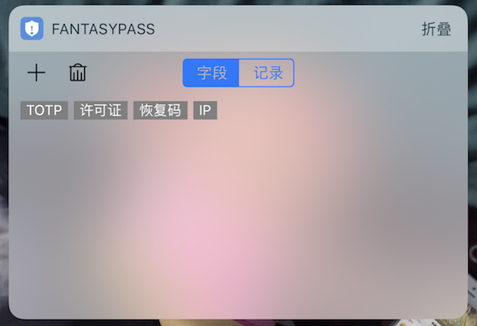

### 通知小插件

#### 创作缘由

随着FantasyPass更加完善的特性：

* 自动填充
* 自定义键盘
* Javascript插件

基本需要的功能都已经有了。但是在我日常使用中遇到了一下情景，例如：我要复制某些文字添加到FantasyPass作为自定义字段。那么操作如下：

1. 复制 
2. 切换到FantasyPass 
3. 解锁进入相应的登录项 
4. 编辑 
5. 添加自定义字段 
6. 输入或者粘贴 
7. 保存

因为这一系列操作必须同一时间完成，始终感觉繁琐了一些，于是自己写了个插件。作为添加自定义字段的中转站。直接下拉通知栏，不用切换应用就可以保存需要添加的自定义字段了。

#### 添加小插件

IOS 11添加步骤：

1. 主屏幕下拉，显示通知界面
2. 滑到左边插件界面，下滑到最底部
3. 点击编辑，添加FantasyPass插件

### 插件使用

以添加TOTP为例：

第一阶段：

1. 复制TOTP内容
2. 下拉到通知界面并切换到FantasyPass小插件界面
3. 点击TOTP

你可以完成了，休息会。过几天再开始第二阶段？都行！

第二阶段：

1. 解锁进入相应的登录项 
2. 编辑 
3. 添加自定义字段 
4. 点击Match Box下的TOTP。
5. 保存

虽然步骤不少，但是确实方便多了。而且第二阶段可以简化。这个在之后做简化和优化！

> 另外插件之后将会包含许多方便的功能。已经计划了许多。之后有时间陆续实现..
